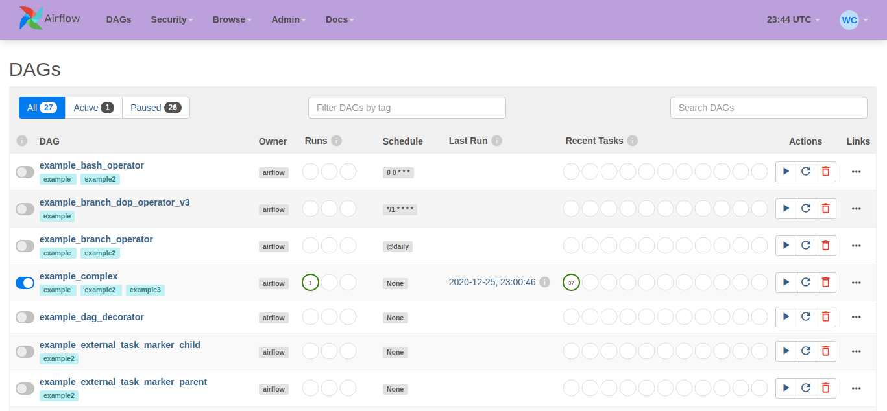
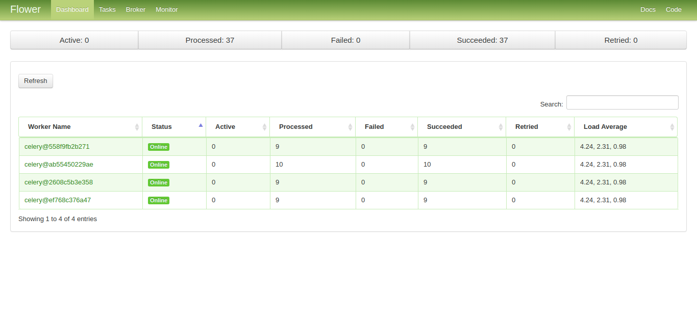

# Airflow Celery Workers

This repo contains a setup to config Airflow 2.0 with Celery workers. To do it, two databases (Postgres and Redis) are setup: Postgres as the scheduler and webserver auxiliar; and Redis as the broker database and connection between the scheduler and workers. Besides the two databases and workers containers, the scheduler and other two UIs are setup in containers: Airflow Webserver UI (at port 8080) and Airflow Flower UI (at port 5555).

## How to use

Locally, just build up the docker containers and set the desired number of workers. The following code example set 4 celery workers:

```bash
docker-compose up -d --scale worker=4
```

To build up only one worker, you can run the following command:

```bash
docker-compose up -d
```

By default, you can access the Airflow Webserver UI in `http://localhost:8080` and the Airflow Flower UI in `http://localhost:5555/flower/`. In GCP virtual machines, you will need setup a proxy like Nginx to redirect the addresses to the ports 80 or 443 and then get access to the UI by the external IP. By running `install_dependencies.sh` and `app/config.sh` scripts, the dependencies like Docker, Nginx, StackDriver Agent and proxy configs are setted with the external IP of the virtual machine as the following sequence of commands:

```bash
sudo bash install_dependencies.sh
sudo docker-compose up -d --scale worker=4
sudo bash config.sh $(curl -s http://whatismyip.akamai.com/) proxy_app
```

So, if your VM has an external IP like `123.456.789.101` you will get access to the UIs in `http://123.456.789.101` and `http://123.456.789.101/flower/`. Don't forget to enable the http access in the machine settings. By default, the UIs can be accessed with login `admin` and password `admin`. You can can set better credentials in the `docker-compose.yaml` file in `x-default-user` section.

To configure the workers in different machines from scheduler and web UIs, get up a VM and run the app config scripts normally. Then, build up the scheduler, UIs and databases containers as this (without worker containers):

```bash
sudo bash install_dependencies.sh
docker-compose up -d webserver flower
sudo bash config.sh $(curl -s http://whatismyip.akamai.com/) proxy_app
```

To setup the workers, get up the worker VMs and install their dependencies as the app configuration. Configure the connections to reach the database addresses with their internal IPs: if the database host internal IP was `10.128.0.100`, you need to replace it in postgres and redis connections like `redis://10.128.0.100:6379/1`. After this, first build up the worker container and then get his hostname so run the worker config script as the following example:

```bash
sudo bash install_dependencies.sh
docker-compose up -d worker
sudo bash config.sh $(docker exec -it airflow_celery_workers_worker_1 env | grep "HOSTNAME=" | sed "s/HOSTNAME=//") proxy_worker
```






